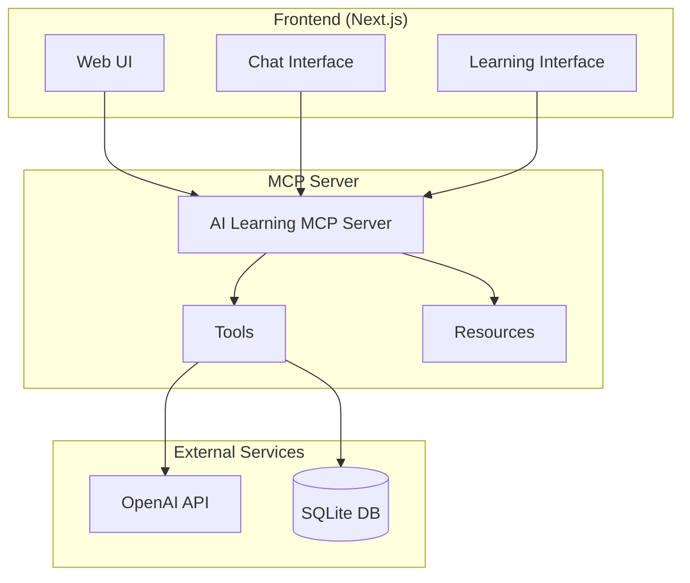
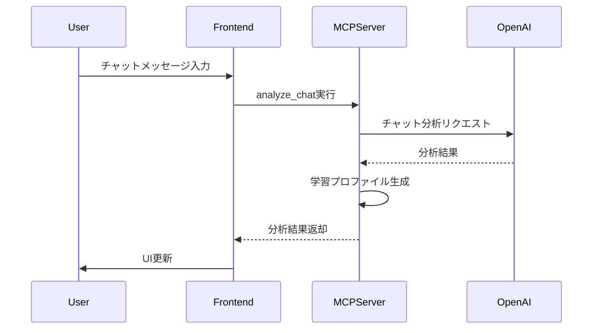
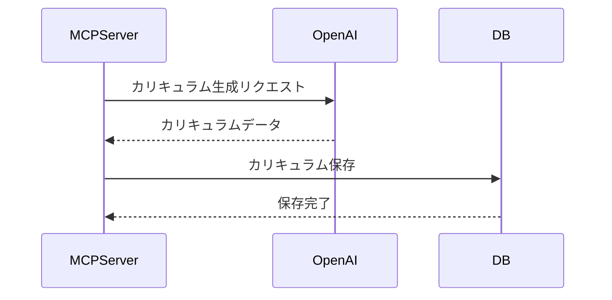

# AI Learning Platform アーキテクチャドキュメント

## 概要
AI Learning Platformは、OpenAI GPT-4o-miniを活用したパーソナライズド学習プラットフォームです。MCPサーバーを介してAIとの対話を実現し、ユーザーに最適化された学習カリキュラムを提供します。

## システムアーキテクチャ

## コンポーネント構成

### フロントエンド
- Next.js v14を使用
- TypeScriptで実装
- Tailwind CSSでスタイリング

主要コンポーネント：
- ChatInterface: AIとの対話インターフェース
- LearningPage: 学習プログラム表示
- AssessmentPage: 学習アセスメント

### MCPサーバー
- Pythonで実装
- FastAPIをベースに使用
- OpenAI APIとの統合

提供ツール：
1. analyze_chat: チャット分析
2. generate_curriculum: カリキュラム生成
3. update_recommendations: レコメンデーション更新

### データベース
- SQLiteを使用（初期実装）
- 将来的にPostgreSQLへの移行を想定

## データフロー

1. ユーザーインタラクション

2. カリキュラム生成

## セキュリティ対策

### API認証
- OpenAI APIキーの安全な管理
- 環境変数での機密情報管理

### データ保護
- SQLiteデータベースのアクセス制御
- センシティブデータの暗号化

## スケーラビリティ

### 現状の制限
- ローカルSQLiteデータベース
- 単一サーバーでの運用

### 将来的な拡張計画
- PostgreSQLへの移行
- コンテナ化による水平スケーリング
- キャッシュ層の導入
