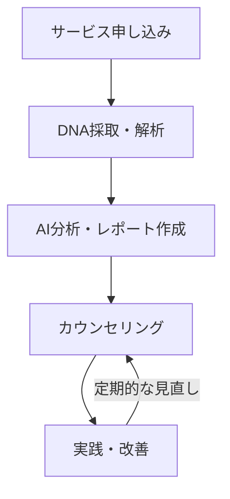
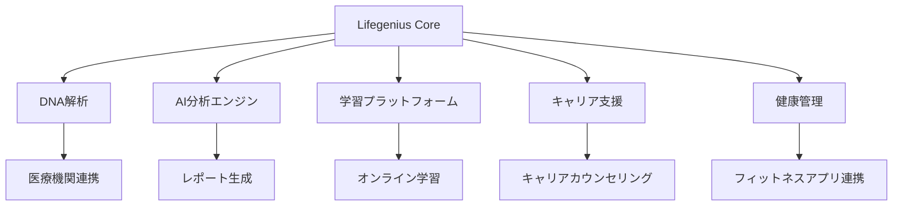

# 🧬🧠 Lifegenius

!!! note "サービス概要"
    Lifegeniusは、遺伝子とAIを融合し、あなたの潜在能力を解き放つパーソナライズド・ライフデザインプラットフォームです。自己発見から生涯にわたる成長まで、あなたの人生を豊かにします。

## ミッション
!!! success "私たちの使命"
    遺伝子データとAIの力を活用し、一人ひとりの潜在能力を最大限に引き出し、自己実現をサポートすることで、より豊かな人生を送れる社会を実現する。

## ビジョン
!!! tip "目指す未来"
    パーソナライズド・ライフデザインのリーディングカンパニーとして、人々が自らの可能性を最大限に開花させ、幸福な人生を送るためのインフラとなる。

## サービス利用フロー

## サービス全体像

## 特徴
* 🧬 **科学的根拠に基づくパーソナライズ**: 遺伝子検査結果とAI分析を組み合わせ、客観的で精度の高い自己分析を提供。
* 📚 **最適化された学習体験**: 遺伝的特徴と学習進捗に基づいた個別カリキュラムで、効率的かつ効果的な学習を実現。
* 🎯 **最適なキャリアパス提案**: 遺伝的傾向、興味関心、スキルを総合的に分析し、最適なキャリアパスを提示。
* 💪 **生涯にわたる成長サポート**: 学習、キャリア、健康、ウェルネスまで、人生のあらゆる側面を包括的に支援。
* 📊 **データに基づいた意思決定**: 分析結果を分かりやすく可視化し、データに基づいた意思決定をサポート。
* 🔄 **継続的なアップデート**: 最新の研究成果や技術動向を反映し、常に最適なサービスを提供。

## 主な機能

!!! info "🧬 DNA解析とAI分析"
    **高度な遺伝子解析**
    
    * 最新の遺伝子解析技術を活用
    * 400以上の特性を分析
    * 医療グレードの精度
    * プライバシー保護対策

    **AIによる分析システム**
    
    * ディープラーニングによる解析
    * パターンマッチング
    * 継続的な精度向上
    * リアルタイムデータ統合

!!! example "📊 パーソナライズドレポート"
    **レポートの特徴**
    
    * インタラクティブなデータ可視化
    * 詳細な解説付き
    * 実用的な提案
    * 定期的な更新

    **分析カテゴリー**
    
    * 能力・適性分析
    * 健康リスク評価
    * パーソナリティ分析
    * キャリア適性診断

!!! tip "📚 学習プログラム"
    **学習最適化**
    
    * 個別学習スタイル分析
    * アダプティブラーニング
    * 進捗トラッキング
    * AI教材推薦

    **主要機能**
    
    * カスタムカリキュラム
    * オンライン教材
    * 進捗レポート
    * メンター支援

!!! success "💼 キャリア支援"
    **キャリアプランニング**
    
    * 適性診断
    * スキルマップ作成
    * キャリアパス設計
    * 業界分析

    **サポート体制**
    
    * 専門カウンセラー
    * メンタリング
    * スキル開発支援
    * 転職支援

!!! note "🏃 健康管理"
    **健康サポート**
    
    * 遺伝的リスク評価
    * 運動プログラム作成
    * 食事アドバイス
    * ストレス管理

    **連携機能**
    
    * 健康管理アプリ連携
    * ウェアラブル連携
    * 医療データ統合
    * 定期的な健康レポート

## よくある質問（FAQ）

!!! question "遺伝子検査は安全ですか？"
    はい、提携医療機関での検査は完全に安全です。必要なのは唾液のみで、痛みを伴う採取は一切ありません。

!!! question "データの保護は大丈夫ですか？"
    遺伝子データは最高レベルのセキュリティで保護されています。データの利用は厳密に管理され、第三者への提供は一切行いません。

!!! question "結果が出るまでどのくらいかかりますか？"
    遺伝子検査結果は約2-3週間でお届けします。その後、AI分析とレポート作成に1週間程度かかります。

!!! question "途中でプランの変更は可能ですか？"
    はい、いつでもプランのアップグレードが可能です。ダウングレードは契約期間終了時に可能です。

!!! warning "免責事項"
    遺伝子検査結果は可能性を示すものであり、絶対的な決定要因ではありません。生活環境や個人の努力など、様々な要因が成功には関係します。
